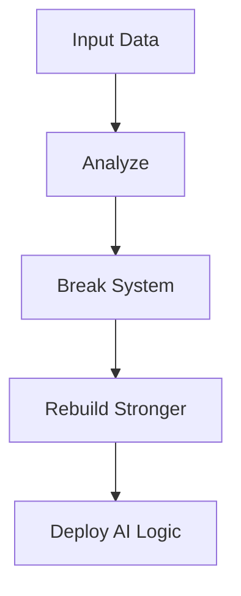

# 🌌 ZOUBAIRE.exe // CYBER ANIME CORE

<p align="center">
  
</p>

<p align="center">
  
</p>

---

## 🧠 AVATAR CORE

<p align="center">
  
</p>

```bash id="animecore01"
> entity: ZOUBAIRE.exe
> class: Cyber Intelligence
> state: evolving
> objective: dominate systems
```

---

## ⚡ POWER LEVEL

<p align="center">
  
  
</p>

---

## 🌀 SKILL MATRIX

<p align="center">
  
</p>

---

## 🔮 NEURAL STREAM

<p align="center">
  
  
</p>

---

## 🧬 SYSTEM FLOW



---

## 🌐 LINK PORTAL

<p align="center">
  <a href="https://discord.gg/zoubaire_"></a>
  <a href="https://instagram.com/zoubaire_26"></a>
  <a href="https://tiktok.com/@zoubaire_26"></a>
  <a href="https://x.com/zoubaire_26"></a>
</p>

---

## ⚡ FINAL FORM

<p align="center">
  
</p>
