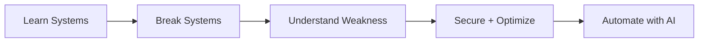
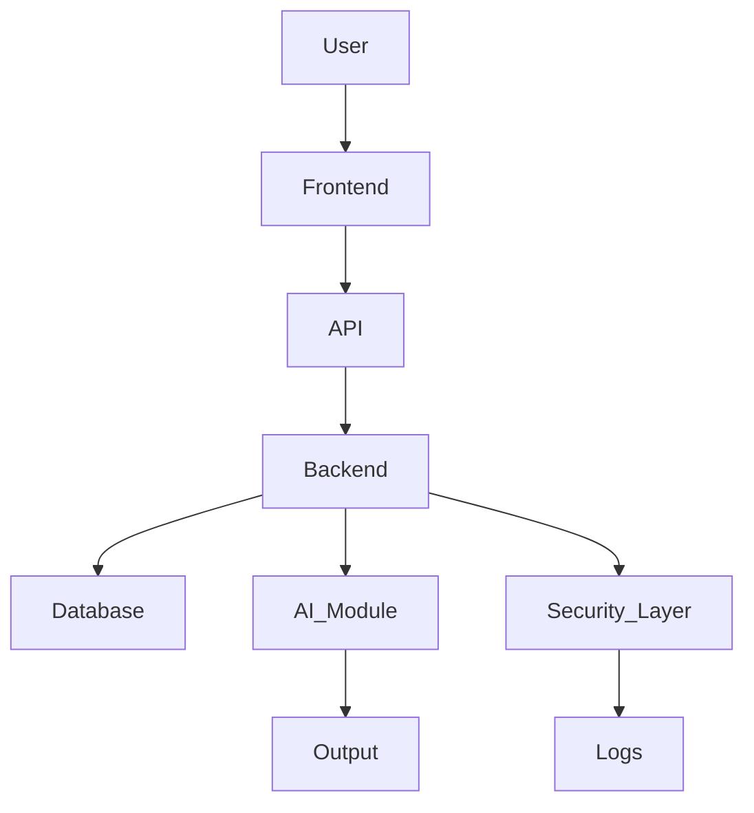

# ⚡ ZOUBAIRE.exe | Cybersecurity • AI • Systems

<p align="center">
  
</p>

---

## 🧠 SYSTEM PROFILE

```bash
$ whoami
> Zoubaire

$ role
> Cybersecurity + AI Engineer (in progress)

$ mindset
> "Break → Understand → Secure → Automate"
```

---

## 🧩 CORE FOCUS



---

## ⚔️ CURRENT MISSION

* 🔐 Master **Cybersecurity (Networking → Exploitation → Defense)**
* 🤖 Build **AI-powered tools (automation + intelligence)**
* 🧠 Think like a **hacker, build like an engineer**
* 🚀 Become **dangerously skilled (not average)**

---

## 🛠️ TECH STACK

### 💻 Languages


### ⚙️ Backend / Systems


### ☁️ Cloud / Infra


### 🧠 AI / Data


---

## 🧪 PROJECT ARCHITECTURE (HOW I BUILD)



---

## ⚡ LIVE TERMINAL

```bash
> initializing mindset...
✔ curiosity loaded
✔ discipline loading...
✔ skill_tree expanding...

> running: become_elite_dev.exe
[██████████░░░░░░░░░] 60%
```

---

## 📊 GITHUB ANALYTICS

<p align="center">
  
  
</p>

<p align="center">
  
</p>

---

## 🌐 NETWORK

<p align="center">
  <a href="https://discord.gg/zoubaire_"></a>
  <a href="https://instagram.com/zoubaire_26"></a>
  <a href="https://tiktok.com/@zoubaire_26"></a>
  <a href="https://x.com/zoubaire_26"></a>
</p>

---

## 🧬 PHILOSOPHY

```text
Most people use systems.
Some understand them.
A few break them.

I aim to master all three.
```

---

<p align="center">
  
</p>
